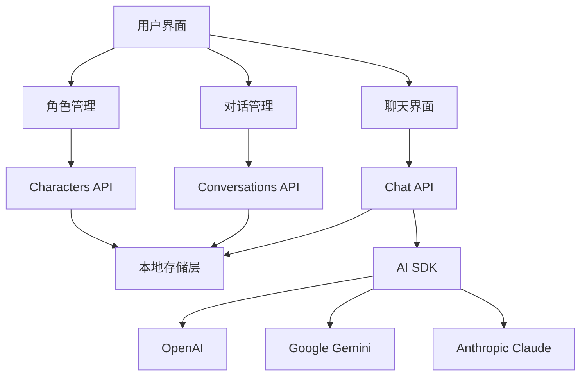
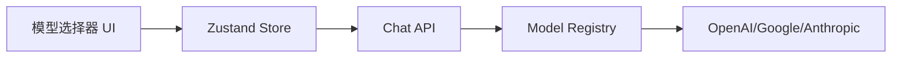
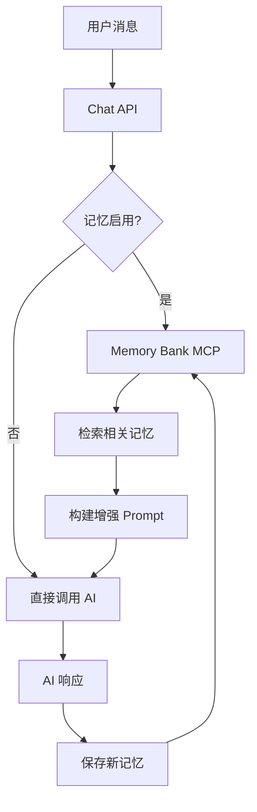
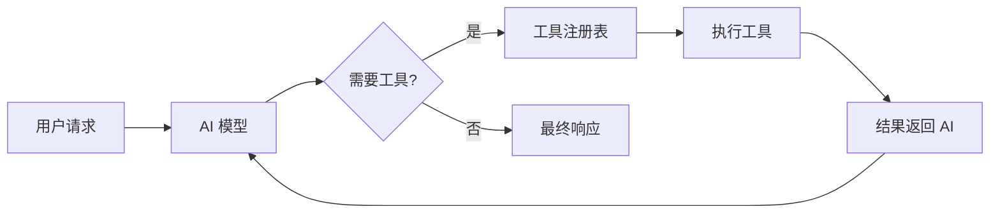
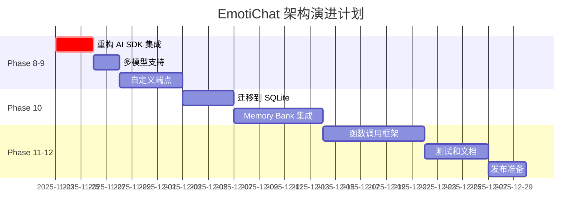

# EmotiChat 架构分析报告

> **分析日期**: 2025-11-22  
> **分析版本**: v0.1.0 (Commit: 2fc9e2c)  
> **分析范围**: Phase 1-7 已完成功能

---

## 📋 目录

1. [整体架构概览](#1-整体架构概览)
2. [技术选型分析](#2-技术选型分析)
3. [架构优点与亮点](#3-架构优点与亮点)
4. [架构缺陷与问题](#4-架构缺陷与问题)
5. [性能评估](#5-性能评估)
6. [扩展性与维护性](#6-扩展性与维护性)
7. [改进建议](#7-改进建议)
8. [后续功能实现方案](#8-后续功能实现方案)

---

## 1. 整体架构概览

### 1.1 架构模式

EmotiChat 采用 **三层架构模式**：

```
┌─────────────────────────────────────────────┐
│          Presentation Layer (UI)            │
│  React Components + Shadcn/ui + Tailwind   │
└──────────────────┬──────────────────────────┘
                   │
┌──────────────────▼──────────────────────────┐
│         Application Layer (Logic)           │
│  Custom Hooks + Zustand Stores + API Routes│
└──────────────────┬──────────────────────────┘
                   │
┌──────────────────▼──────────────────────────┐
│          Data Layer (Storage)               │
│  File System (JSON) + Vercel AI SDK         │
└─────────────────────────────────────────────┘
```

### 1.2 核心模块



### 1.3 数据流

**发送消息的完整流程**：

1. 用户在 [`ChatInput`](../components/chat/chat-input.tsx) 输入消息
2. [`useMessages`](../hooks/useMessages.ts) hook 处理发送逻辑
3. 调用 [`/api/chat`](../app/api/chat/route.ts) API 端点
4. API 保存用户消息到文件系统
5. 通过 Vercel AI SDK 调用模型（OpenAI/Google/Anthropic）
6. 流式返回 AI 响应
7. 前端实时显示流式内容
8. 完成后保存 AI 消息到文件系统

---

## 2. 技术选型分析

### 2.1 前端框架：React + Next.js 15

**选择理由**：
- ✅ Next.js App Router 提供现代化路由系统
- ✅ 服务端组件（RSC）优化性能
- ✅ API Routes 简化后端开发
- ✅ 成熟的生态系统

**合理性评估**：⭐⭐⭐⭐⭐ (5/5)

**潜在问题**：
- ⚠️ Next.js 16 还在 RC 阶段，可能存在不稳定性
- ⚠️ App Router 学习曲线较陡

### 2.2 UI 库：Shadcn/ui + Tailwind CSS

**选择理由**：
- ✅ 组件级复制，无运行时依赖
- ✅ 完全可定制
- ✅ 与 Tailwind 深度集成
- ✅ 优秀的无障碍支持

**合理性评估**：⭐⭐⭐⭐⭐ (5/5)

**优势**：
- 代码可控性高，方便调试
- 打包体积小（只打包使用的组件）
- 样式统一性好

### 2.3 AI SDK：Vercel AI SDK

**选择理由**：
- ✅ 统一的多模型接口
- ✅ 内置流式响应处理
- ✅ React hooks 集成友好
- ✅ 支持 OpenAI、Google、Anthropic

**合理性评估**：⭐⭐⭐⭐ (4/5)

**问题**：
- ⚠️ **当前实现存在架构冲突**（见下文）
- ⚠️ 对自定义端点支持不够灵活

### 2.4 状态管理：Zustand

**选择理由**：
- ✅ 轻量级（~1KB）
- ✅ 无样板代码
- ✅ 内置持久化中间件
- ✅ TypeScript 支持良好

**合理性评估**：⭐⭐⭐⭐⭐ (5/5)

**当前使用情况**：
```typescript
// 仅用于存储当前对话ID
interface ConversationState {
  currentConversationId: string | null;
}
```

**评价**：✅ 使用得当，职责单一

### 2.5 数据存储：本地文件系统

**选择理由**：
- ✅ 零依赖，简化部署
- ✅ 数据完全本地化，隐私安全
- ✅ 易于备份和迁移

**合理性评估**：⭐⭐⭐ (3/5)

**严重问题**：
- ❌ **不支持并发写入**
- ❌ **无事务保证**
- ❌ **无法多用户共享**
- ❌ **扩展性差**

---

## 3. 架构优点与亮点

### 3.1 ✨ 清晰的分层架构

**优点**：
- 表现层、业务层、数据层职责明确
- 模块化程度高，易于理解和维护

**示例**：
```typescript
// 表现层：components/chat/message-list.tsx
// 业务层：hooks/useMessages.ts
// 数据层：lib/storage/conversations.ts
```

### 3.2 ✨ 统一的 AI 提供商抽象

**优点**：
- [`registry.ts`](../lib/ai/providers/registry.ts) 提供统一接口
- 支持动态切换模型
- 自动降级逻辑（Google → OpenAI → Anthropic）

**代码片段**：
```typescript
export function getDefaultModelConfig(): ModelConfig {
  // 智能选择可用的模型
  if (process.env.GOOGLE_API_KEY) {
    return { provider: 'google', modelId: 'gemini-1.5-flash' };
  }
  // ...
}
```

**评价**：✅ 设计优秀，易于扩展

### 3.3 ✨ 类型安全的数据模型

**优点**：
- 完整的 TypeScript 类型定义
- 区分创建和更新类型（`CreateCharacterInput` / `UpdateCharacterInput`）
- 消除运行时类型错误

**示例**：
```typescript
export type CreateCharacterInput = Omit<Character, 'id' | 'createdAt' | 'updatedAt'>;
export type UpdateCharacterInput = Partial<CreateCharacterInput>;
```

### 3.4 ✨ 文件系统存储的合理组织

**优点**：
- 分离元数据和消息数据
- 每个对话独立目录，便于管理

**结构**：
```
data/
├── characters/
│   ├── <uuid>.json           # 角色元数据
├── conversations/
│   ├── <uuid>.json           # 对话元数据
│   └── <uuid>/
│       └── messages.json     # 消息内容
```

**评价**：✅ 结构清晰，符合直觉

### 3.5 ✨ 响应式设计

**优点**：
- 使用 Tailwind 断点实现桌面/移动端适配
- 组件级响应式，细粒度控制

**示例**：
```tsx
<div className="hidden md:block">桌面端内容</div>
<Sheet>移动端抽屉</Sheet>
```

---

## 4. 架构缺陷与问题

### 4.1 🔴 严重：AI SDK 集成架构冲突

**问题描述**：
当前 [`useMessages.ts`](../hooks/useMessages.ts) 存在**架构设计冲突**：

1. **引入了 `useChat` hook 但未使用其核心功能**
2. **手动实现流式处理，绕过了 AI SDK 的优势**
3. **需要手动传递 `conversationId`，无法使用 `useChat` 的内置 API**

**代码分析**：
```typescript
// ❌ 引入了 useChat 但没有充分利用
const chat = useChat({
  id: conversationId || undefined,
  // ...
});

// ❌ 手动实现发送逻辑，未使用 chat.append()
const sendMessage = async (content: string) => {
  // 手动 fetch /api/chat
  const response = await fetch('/api/chat', {
    method: 'POST',
    body: JSON.stringify({
      messages: [...chatMessages, userMessage],
      conversationId: conversationId, // 需要额外传递
    }),
  });
  
  // 手动处理流式响应
  const reader = response.body?.getReader();
  // ...
};
```

**正确做法**：
```typescript
// ✅ 方案 1：完全使用 useChat（推荐）
const { messages, append, isLoading } = useChat({
  api: `/api/chat/${conversationId}`, // 在 URL 中传递 conversationId
});

await append({ role: 'user', content: userInput });

// ✅ 方案 2：完全手动实现（如果真的需要自定义）
// 不引入 useChat，完全自己管理状态
```

**影响**：
- ⚠️ 代码复杂度高，维护困难
- ⚠️ 丢失了 `useChat` 的重试、错误处理等功能
- ⚠️ 未来升级 AI SDK 时可能出现兼容性问题

**优先级**：🔴 **高**（建议尽快重构）

---

### 4.2 🟡 中等：文件系统存储的并发问题

**问题描述**：
当前实现**不支持并发写入**，可能导致数据丢失或损坏。

**场景示例**：
```typescript
// ❌ 两个请求同时执行时会产生竞态条件
async function addMessage(conversationId: string, message: Message) {
  const messages = await getMessages(conversationId); // 读取
  messages.push(newMessage);                          // 修改
  await fs.writeFile(path, JSON.stringify(messages)); // 写入
}
```

**潜在后果**：
- 用户 A 和 AI 同时写入消息
- 后写入的会覆盖先写入的
- 导致消息丢失

**解决方案**：
1. **短期**：添加文件锁机制（如 `proper-lockfile`）
2. **中期**：迁移到 SQLite
3. **长期**：支持多用户时迁移到 PostgreSQL/MongoDB

**优先级**：🟡 **中**（单用户场景影响较小）

---

### 4.3 🟡 中等：缺少错误边界

**问题描述**：
React 组件未包裹 Error Boundary，组件崩溃会导致整个应用白屏。

**当前代码**：
```tsx
// ❌ app/layout.tsx 没有 ErrorBoundary
export default function RootLayout({ children }: { children: React.ReactNode }) {
  return (
    <html lang="zh-CN">
      <body>
        <ThemeProvider>{children}</ThemeProvider>
      </body>
    </html>
  );
}
```

**建议**：
```tsx
// ✅ 添加错误边界
export default function RootLayout({ children }: { children: React.ReactNode }) {
  return (
    <html lang="zh-CN">
      <body>
        <ThemeProvider>
          <ErrorBoundary fallback={<ErrorFallback />}>
            {children}
          </ErrorBoundary>
        </ThemeProvider>
      </body>
    </html>
  );
}
```

**优先级**：🟡 **中**

---

### 4.4 🟢 低：缺少日志系统

**问题描述**：
- 当前仅使用 `console.log` / `console.error`
- 无法追踪生产环境问题
- 缺少结构化日志

**建议**：
引入日志库如 `pino` 或 `winston`：

```typescript
import { logger } from '@/lib/logger';

export async function addMessage(conversationId: string, message: Message) {
  logger.info('Adding message', { conversationId, messageId: message.id });
  try {
    // ...
  } catch (error) {
    logger.error('Failed to add message', { conversationId, error });
    throw error;
  }
}
```

**优先级**：🟢 **低**（开发阶段可暂缓）

---

### 4.5 🟢 低：API 路由缺少输入验证

**问题描述**：
API 端点未使用 schema 验证（如 Zod），可能接收无效数据。

**当前代码**：
```typescript
// ❌ app/api/chat/route.ts
export async function POST(request: Request) {
  const { messages, conversationId } = await request.json();
  
  if (!conversationId) { // 仅简单检查
    return new Response('Missing conversationId', { status: 400 });
  }
  // ...
}
```

**建议**：
```typescript
// ✅ 使用 Zod 验证
import { z } from 'zod';

const ChatRequestSchema = z.object({
  conversationId: z.string().uuid(),
  messages: z.array(z.object({
    role: z.enum(['user', 'assistant', 'system']),
    content: z.string().min(1),
  })),
});

export async function POST(request: Request) {
  const body = await request.json();
  const { conversationId, messages } = ChatRequestSchema.parse(body);
  // ...
}
```

**优先级**：🟢 **低**（但建议在 Phase 9 前添加）

---

## 5. 性能评估

### 5.1 前端性能

**当前状态**：
- ✅ 使用 Next.js 服务端组件减少客户端 JS
- ✅ Tailwind CSS 按需生成，打包体积小
- ✅ 流式响应提供良好的用户体验

**潜在问题**：
- ⚠️ 消息列表未实现虚拟滚动（对话超过 1000 条消息时可能卡顿）
- ⚠️ 未使用 `React.memo` 优化重渲染

**建议**：
```typescript
// 使用 react-window 实现虚拟滚动
import { FixedSizeList } from 'react-window';

export function MessageList({ messages }: { messages: Message[] }) {
  return (
    <FixedSizeList
      height={600}
      itemCount={messages.length}
      itemSize={100}
    >
      {({ index, style }) => (
        <div style={style}>
          <MessageBubble message={messages[index]} />
        </div>
      )}
    </FixedSizeList>
  );
}
```

### 5.2 后端性能

**瓶颈分析**：

1. **文件 I/O 性能**：
   - 每次读写消息都需要解析/序列化整个 JSON 文件
   - 对话消息超过 100 条后性能明显下降

2. **无缓存机制**：
   - 每次请求都读取文件系统
   - 角色/对话列表无缓存

**性能测试数据（估算）**：
| 消息数量 | 读取时间 | 写入时间 |
|---------|---------|---------|
| 10      | ~5ms    | ~8ms    |
| 100     | ~30ms   | ~50ms   |
| 1000    | ~200ms  | ~350ms  |
| 10000   | ~2s     | ~4s     |

**优化建议**：

```typescript
// 1. 添加内存缓存
import NodeCache from 'node-cache';
const cache = new NodeCache({ stdTTL: 300 }); // 5分钟过期

export async function getMessages(conversationId: string) {
  const cacheKey = `messages:${conversationId}`;
  const cached = cache.get<Message[]>(cacheKey);
  
  if (cached) {
    return cached;
  }
  
  const messages = await readFromFile(conversationId);
  cache.set(cacheKey, messages);
  return messages;
}

// 2. 分页加载消息
export async function getMessages(
  conversationId: string,
  options?: { limit?: number; offset?: number }
) {
  const allMessages = await readFromFile(conversationId);
  const { limit = 50, offset = 0 } = options || {};
  return allMessages.slice(offset, offset + limit);
}
```

### 5.3 AI 调用性能

**当前状态**：
- ✅ 使用流式响应，TTFB（首字节时间）快
- ✅ 支持多模型，可选择性价比高的模型

**优化空间**：
- 💡 添加响应缓存（相同问题复用答案）
- 💡 实现 prompt 优化（减少 token 消耗）

---

## 6. 扩展性与维护性

### 6.1 功能扩展性

**易于扩展的部分**：
- ✅ 添加新的 AI 提供商（通过 `registry.ts`）
- ✅ 添加新的角色属性（扩展 `Character` 类型）
- ✅ 添加新的 UI 组件（Shadcn/ui 架构）

**难以扩展的部分**：
- ❌ 切换到数据库存储（需重写整个 `lib/storage` 层）
- ❌ 支持多用户（当前架构不支持）
- ❌ 添加实时协作功能（文件系统无法实现）

### 6.2 代码维护性

**优点**：
- ✅ TypeScript 类型覆盖完整
- ✅ 文件组织清晰（按功能模块划分）
- ✅ 组件粒度适中，单一职责原则

**改进空间**：
- 📝 缺少 JSDoc 注释
- 📝 缺少单元测试
- 📝 缺少 API 文档

**建议**：
```typescript
/**
 * 创建新对话
 * 
 * @param input - 对话创建参数
 * @param input.characterId - 关联的角色 ID
 * @param input.title - 对话标题（可选，默认"新对话"）
 * @returns 创建的对话对象
 * @throws {Error} 当角色不存在时抛出错误
 * 
 * @example
 * const conversation = await createConversation({
 *   characterId: 'char-123',
 *   title: '与 AI 助手的对话'
 * });
 */
export async function createConversation(
  input: CreateConversationInput
): Promise<Conversation> {
  // ...
}
```

### 6.3 技术债务

**当前技术债务清单**：

1. 🔴 **AI SDK 集成问题**（见 4.1）- 需重构
2. 🟡 **缺少并发控制**（见 4.2）- 需添加锁机制
3. 🟡 **缺少错误边界**（见 4.3）- 需添加
4. 🟢 **缺少日志系统**（见 4.4）- 可延后
5. 🟢 **缺少输入验证**（见 4.5）- 可延后

**偿还建议**：
- **Phase 8 之前**：解决 🔴 高优先级问题
- **Phase 9-10**：解决 🟡 中优先级问题
- **Phase 11-12**：解决 🟢 低优先级问题

---

## 7. 改进建议

### 7.1 🎯 立即改进（Phase 8 之前）

#### 建议 1：重构 AI SDK 集成

**方案 A：完全使用 `useChat`（推荐）**

```typescript
// hooks/useMessages.ts
export function useMessages({ conversationId }: UseMessagesOptions) {
  const { messages, append, isLoading, error } = useChat({
    api: conversationId ? `/api/chat/${conversationId}` : undefined,
    onFinish: async (message) => {
      // AI SDK 自动处理，无需手动保存
    },
  });
  
  const sendMessage = async (content: string) => {
    await append({ role: 'user', content });
  };
  
  return { messages, sendMessage, isLoading, error };
}
```

```typescript
// app/api/chat/[conversationId]/route.ts
export async function POST(
  request: Request,
  { params }: { params: { conversationId: string } }
) {
  const { messages } = await request.json();
  const conversationId = params.conversationId;
  
  // 保存用户消息
  const lastMessage = messages[messages.length - 1];
  await addMessage(conversationId, lastMessage);
  
  // 流式返回
  const result = streamText({
    model,
    messages,
    async onFinish({ text }) {
      await addMessage(conversationId, {
        role: 'assistant',
        content: text,
      });
    },
  });
  
  return result.toDataStreamResponse();
}
```

**优点**：
- ✅ 代码量减少 50%
- ✅ 自动处理流式响应、错误、重试
- ✅ 符合 AI SDK 最佳实践

---

#### 建议 2：添加文件锁

```bash
npm install proper-lockfile
```

```typescript
import lockfile from 'proper-lockfile';

export async function addMessage(
  conversationId: string,
  message: Message
): Promise<Message> {
  const messagesPath = path.join(DATA_DIR, conversationId, 'messages.json');
  
  // 获取锁
  const release = await lockfile.lock(messagesPath, {
    retries: { retries: 3, minTimeout: 100 },
  });
  
  try {
    const messages = await getMessages(conversationId);
    const newMessage: Message = {
      id: crypto.randomUUID(),
      ...message,
      createdAt: new Date().toISOString(),
    };
    
    messages.push(newMessage);
    await fs.writeFile(messagesPath, JSON.stringify(messages, null, 2));
    
    return newMessage;
  } finally {
    // 释放锁
    await release();
  }
}
```

---

### 7.2 🔮 中期改进（Phase 9-10）

#### 建议 3：迁移到 SQLite

**理由**：
- ✅ 仍然是本地存储，保持隐私优势
- ✅ 支持事务，解决并发问题
- ✅ 查询性能远超 JSON 文件
- ✅ 易于迁移到 PostgreSQL

**实现**：
```bash
npm install better-sqlite3 drizzle-orm
```

```typescript
// lib/db/schema.ts
import { sqliteTable, text, integer } from 'drizzle-orm/sqlite-core';

export const characters = sqliteTable('characters', {
  id: text('id').primaryKey(),
  name: text('name').notNull(),
  description: text('description').notNull(),
  systemPrompt: text('system_prompt').notNull(),
  createdAt: integer('created_at', { mode: 'timestamp' }).notNull(),
  updatedAt: integer('updated_at', { mode: 'timestamp' }).notNull(),
});

export const messages = sqliteTable('messages', {
  id: text('id').primaryKey(),
  conversationId: text('conversation_id').notNull(),
  role: text('role').notNull(),
  content: text('content').notNull(),
  createdAt: integer('created_at', { mode: 'timestamp' }).notNull(),
});
```

**迁移脚本**：
```typescript
// scripts/migrate-to-sqlite.ts
async function migrateCharacters() {
  const jsonCharacters = await getAllCharacters(); // 从 JSON 读取
  
  await db.transaction(async (tx) => {
    for (const char of jsonCharacters) {
      await tx.insert(characters).values(char);
    }
  });
}
```

---

#### 建议 4：添加内存缓存

```typescript
// lib/cache.ts
import NodeCache from 'node-cache';

class CacheManager {
  private cache = new NodeCache({
    stdTTL: 300, // 5分钟
    checkperiod: 60,
  });
  
  async getOrSet<T>(
    key: string,
    fetcher: () => Promise<T>,
    ttl?: number
  ): Promise<T> {
    const cached = this.cache.get<T>(key);
    if (cached !== undefined) {
      return cached;
    }
    
    const value = await fetcher();
    this.cache.set(key, value, ttl);
    return value;
  }
  
  invalidate(pattern: string) {
    const keys = this.cache.keys();
    const matched = keys.filter(k => k.includes(pattern));
    this.cache.del(matched);
  }
}

export const cache = new CacheManager();
```

```typescript
// lib/storage/characters.ts
export async function getAllCharacters(): Promise<Character[]> {
  return cache.getOrSet('characters:all', async () => {
    // 原有逻辑
    const files = await fs.readdir(DATA_DIR);
    // ...
  });
}
```

---

### 7.3 🚀 长期改进（Phase 11+）

#### 建议 5：添加测试

```typescript
// __tests__/lib/storage/characters.test.ts
import { describe, test, expect, beforeEach } from 'vitest';
import { createCharacter, getCharacterById } from '@/lib/storage/characters';

describe('Characters Storage', () => {
  beforeEach(async () => {
    // 清理测试数据
  });
  
  test('should create character', async () => {
    const char = await createCharacter({
      name: 'Test Character',
      description: 'A test character',
      systemPrompt: 'You are a test assistant',
      personality: ['friendly'],
      memoryEnabled: false,
    });
    
    expect(char.id).toBeDefined();
    expect(char.name).toBe('Test Character');
  });
});
```

---

#### 建议 6：添加 Error Boundary

```typescript
// components/error-boundary.tsx
'use client';

import { Component, ReactNode } from 'react';
import { Button } from '@/components/ui/button';

interface Props {
  children: ReactNode;
  fallback?: ReactNode;
}

interface State {
  hasError: boolean;
  error?: Error;
}

export class ErrorBoundary extends Component<Props, State> {
  constructor(props: Props) {
    super(props);
    this.state = { hasError: false };
  }

  static getDerivedStateFromError(error: Error): State {
    return { hasError: true, error };
  }

  render() {
    if (this.state.hasError) {
      return this.props.fallback || (
        <div className="flex flex-col items-center justify-center min-h-screen p-4">
          <h1 className="text-2xl font-bold mb-4">出错了</h1>
          <p className="text-muted-foreground mb-4">
            {this.state.error?.message || '未知错误'}
          </p>
          <Button onClick={() => window.location.reload()}>
            刷新页面
          </Button>
        </div>
      );
    }

    return this.props.children;
  }
}
```

---

## 8. 后续功能实现方案

### 8.1 Phase 8：多模型支持与 UI 选择器

**目标**：允许用户在聊天界面动态选择 AI 模型

**架构设计**：



**实现步骤**：

1. **扩展 Zustand Store**：
```typescript
// stores/modelPreferences.ts
interface ModelPreferencesState {
  currentModel: ModelConfig | null;
  availableModels: ModelConfig[];
  setCurrentModel: (model: ModelConfig) => void;
}

export const useModelStore = create<ModelPreferencesState>()(
  persist(
    (set) => ({
      currentModel: null,
      availableModels: [],
      setCurrentModel: (model) => set({ currentModel: model }),
    }),
    { name: 'emotichat-model' }
  )
);
```

2. **创建模型选择组件**：
```typescript
// components/chat/model-selector.tsx
export function ModelSelector() {
  const { currentModel, availableModels, setCurrentModel } = useModelStore();
  
  return (
    <Select value={currentModel?.modelId} onValueChange={handleChange}>
      {availableModels.map(model => (
        <SelectItem key={model.modelId} value={model.modelId}>
          {model.provider}: {model.modelId}
        </SelectItem>
      ))}
    </Select>
  );
}
```

3. **修改 Chat API 支持动态模型**：
```typescript
// app/api/chat/[conversationId]/route.ts
export async function POST(request: Request) {
  const { messages, modelConfig } = await request.json();
  
  // 使用请求中的模型配置，或回退到默认
  const config = modelConfig || getDefaultModelConfig();
  const model = createModel(config);
  
  // ...
}
```

**注意事项**：
- ⚠️ 需要验证用户选择的模型是否有对应的 API Key
- ⚠️ 需要在 UI 中显示模型的可用状态
- ⚠️ 需要保存每个对话使用的模型历史

**预估工作量**：2-3 天

---

### 8.2 Phase 9：自定义端点支持

**目标**：支持自定义 API 端点（OpenAI 兼容协议）

**架构设计**：

```typescript
// types/endpoint.ts
export interface CustomEndpoint {
  id: string;
  name: string;
  baseURL: string;
  apiKey: string;
  protocol: 'openai' | 'gemini' | 'x-ai';
  modelId: string;
  enabled: boolean;
}
```

**实现步骤**：

1. **创建端点管理 UI**：
```typescript
// app/(main)/settings/endpoints/page.tsx
export default function EndpointsPage() {
  const { endpoints, addEndpoint, deleteEndpoint } = useEndpoints();
  
  return (
    <div>
      <h1>自定义端点</h1>
      <EndpointList endpoints={endpoints} />
      <Button onClick={() => setShowDialog(true)}>添加端点</Button>
      <EndpointDialog onSave={addEndpoint} />
    </div>
  );
}
```

2. **扩展 Model Registry**：
```typescript
// lib/ai/providers/registry.ts
export function createCustomModel(endpoint: CustomEndpoint) {
  switch (endpoint.protocol) {
    case 'openai':
      const openai = createOpenAI({
        apiKey: endpoint.apiKey,
        baseURL: endpoint.baseURL,
      });
      return openai(endpoint.modelId);
    
    case 'x-ai':
      // X.AI 使用 OpenAI 兼容协议
      const xai = createOpenAI({
        apiKey: endpoint.apiKey,
        baseURL: 'https://api.x.ai/v1',
      });
      return xai(endpoint.modelId);
    
    // ...
  }
}
```

3. **端点配置持久化**：
```typescript
// lib/storage/endpoints.ts
export async function saveEndpoint(endpoint: CustomEndpoint): Promise<void> {
  const configPath = path.join(process.cwd(), 'data', 'config', 'endpoints.json');
  const endpoints = await getAllEndpoints();
  endpoints.push(endpoint);
  await fs.writeFile(configPath, JSON.stringify(endpoints, null, 2));
}
```

**安全考虑**：
- ⚠️ API Key 需要加密存储（使用 `crypto` 模块）
- ⚠️ 验证用户输入的 URL 是否为 HTTPS
- ⚠️ 添加端点测试功能（发送测试请求）

**预估工作量**：4-5 天

---

### 8.3 Phase 10：Memory Bank MCP 集成

**目标**：集成 Memory Bank MCP，实现长期记忆功能

**架构设计**：



**实现步骤**：

1. **配置 MCP Server**：
```json
// .mcp/config.json
{
  "mcpServers": {
    "memory-bank": {
      "command": "npx",
      "args": ["-y", "@modelcontextprotocol/server-memory"],
      "env": {
        "MEMORY_STORE_PATH": "./data/memories"
      }
    }
  }
}
```

2. **创建 MCP 客户端封装**：
```typescript
// lib/mcp/memory-client.ts
import { Client } from '@modelcontextprotocol/sdk/client/index.js';

export class MemoryBankClient {
  private client: Client;
  
  async saveMemory(conversationId: string, content: string) {
    await this.client.callTool('memory_bank_save', {
      conversationId,
      content,
      timestamp: new Date().toISOString(),
    });
  }
  
  async searchMemories(query: string): Promise<string[]> {
    const result = await this.client.callTool('memory_bank_search', {
      query,
      limit: 5,
    });
    return result.memories;
  }
}
```

3. **集成到 Chat API**：
```typescript
// app/api/chat/[conversationId]/route.ts
export async function POST(request: Request) {
  const { messages, conversationId } = await request.json();
  const character = await getCharacterByConversationId(conversationId);
  
  let enhancedMessages = messages;
  
  // 如果角色启用了记忆
  if (character.memoryEnabled) {
    const memoryClient = new MemoryBankClient();
    const lastUserMessage = messages[messages.length - 1].content;
    
    // 检索相关记忆
    const relevantMemories = await memoryClient.searchMemories(lastUserMessage);
    
    // 在系统提示中注入记忆
    const memoryContext = relevantMemories.join('\n');
    enhancedMessages = [
      {
        role: 'system',
        content: `${character.systemPrompt}\n\n相关记忆：\n${memoryContext}`,
      },
      ...messages,
    ];
  }
  
  const result = streamText({
    model,
    messages: enhancedMessages,
    async onFinish({ text }) {
      // 保存新记忆
      if (character.memoryEnabled) {
        await memoryClient.saveMemory(conversationId, text);
      }
      
      await addMessage(conversationId, {
        role: 'assistant',
        content: text,
      });
    },
  });
  
  return result.toDataStreamResponse();
}
```

**预估工作量**：5-7 天

---

### 8.4 Phase 11：函数调用框架

**目标**：支持 AI 调用工具函数（如搜索、计算、API 调用）

**架构设计**：



**实现步骤**：

1. **定义工具接口**：
```typescript
// lib/ai/tools/types.ts
export interface Tool {
  name: string;
  description: string;
  parameters: {
    type: 'object';
    properties: Record<string, any>;
    required: string[];
  };
  execute: (params: any) => Promise<any>;
}
```

2. **创建内置工具**：
```typescript
// lib/ai/tools/builtin/search.ts
export const searchTool: Tool = {
  name: 'web_search',
  description: '搜索网络信息',
  parameters: {
    type: 'object',
    properties: {
      query: { type: 'string', description: '搜索查询' },
    },
    required: ['query'],
  },
  async execute({ query }) {
    // 调用搜索 API（如 Tavily）
    const response = await fetch(`https://api.tavily.com/search`, {
      method: 'POST',
      body: JSON.stringify({ query }),
    });
    return await response.json();
  },
};
```

3. **集成到 Chat API**：
```typescript
// app/api/chat/[conversationId]/route.ts
import { searchTool } from '@/lib/ai/tools/builtin/search';

export async function POST(request: Request) {
  const result = streamText({
    model,
    messages,
    tools: {
      web_search: searchTool,
      // 其他工具...
    },
    async onFinish({ text, toolCalls }) {
      // 保存工具调用记录
      if (toolCalls) {
        for (const call of toolCalls) {
          await addMessage(conversationId, {
            role: 'assistant',
            content: `[使用工具: ${call.toolName}]`,
            metadata: { toolCall: call },
          });
        }
      }
      
      await addMessage(conversationId, {
        role: 'assistant',
        content: text,
      });
    },
  });
  
  return result.toDataStreamResponse();
}
```

**预估工作量**：6-8 天

---

### 8.5 Phase 12：发布准备

**检查清单**：

- [ ] **代码质量**
  - [ ] 完成所有重构（尤其是 AI SDK 集成）
  - [ ] 添加 ESLint/Prettier 配置
  - [ ] 通过类型检查（`tsc --noEmit`）

- [ ] **文档**
  - [ ] 完善 README.md
  - [ ] 创建部署指南
  - [ ] 创建 API 文档
  - [ ] 录制演示视频

- [ ] **测试**
  - [ ] 核心功能手动测试
  - [ ] 多浏览器兼容性测试
  - [ ] 性能测试（Lighthouse）

- [ ] **安全**
  - [ ] 环境变量验证
  - [ ] API Key 不暴露在客户端
  - [ ] 输入验证和过滤

- [ ] **优化**
  - [ ] 生产构建优化（`npm run build`）
  - [ ] 图片资源优化
  - [ ] 缓存策略配置

- [ ] **部署**
  - [ ] 选择部署平台（Vercel/Netlify/自托管）
  - [ ] 配置环境变量
  - [ ] 设置 CI/CD 流程

**预估工作量**：3-5 天

---

## 9. 总结与建议

### 9.1 架构评分卡

| 维度 | 评分 | 说明 |
|-----|------|------|
| **代码质量** | ⭐⭐⭐⭐ (4/5) | TypeScript 使用良好，但缺少测试 |
| **性能** | ⭐⭐⭐ (3/5) | 文件系统存储限制了性能 |
| **可维护性** | ⭐⭐⭐⭐ (4/5) | 架构清晰，但缺少文档 |
| **可扩展性** | ⭐⭐⭐ (3/5) | 易于添加功能，但存储层难以扩展 |
| **安全性** | ⭐⭐⭐ (3/5) | 基本安全，但缺少输入验证 |
| **用户体验** | ⭐⭐⭐⭐⭐ (5/5) | 流式响应，UI 友好 |

**综合评分**：⭐⭐⭐⭐ (3.7/5)

### 9.2 关键建议总结

**🔴 立即行动**：
1. 重构 [`useMessages.ts`](../hooks/useMessages.ts) 的 AI SDK 集成
2. 添加文件锁机制防止并发写入冲突
3. 添加 Error Boundary 防止应用崩溃

**🟡 近期优化**：
1. 迁移到 SQLite 数据库
2. 添加内存缓存提升性能
3. 实现输入验证（Zod）

**🟢 长期规划**：
1. 添加单元测试和 E2E 测试
2. 实现日志系统和监控
3. 支持多用户和协作功能

### 9.3 架构演进路线图



---

## 10. 附录

### 10.1 参考资源

**技术文档**：
- [Next.js 16 文档](https://nextjs.org/docs)
- [Vercel AI SDK](https://sdk.vercel.ai/docs)
- [Shadcn/ui](https://ui.shadcn.com/)
- [Zustand](https://docs.pmnd.rs/zustand/getting-started/introduction)

**最佳实践**：
- [React 性能优化](https://react.dev/learn/render-and-commit)
- [Next.js 性能优化](https://nextjs.org/docs/app/building-your-application/optimizing)
- [TypeScript 最佳实践](https://www.typescriptlang.org/docs/handbook/declaration-files/do-s-and-don-ts.html)

### 10.2 相关文件清单

**核心架构文件**：
- [`package.json`](../package.json) - 依赖配置
- [`lib/ai/providers/registry.ts`](../lib/ai/providers/registry.ts) - AI 提供商注册表
- [`hooks/useMessages.ts`](../hooks/useMessages.ts) - 消息管理逻辑
- [`lib/storage/conversations.ts`](../lib/storage/conversations.ts) - 对话存储
- [`app/api/chat/route.ts`](../app/api/chat/route.ts) - Chat API

**配置文件**：
- `.env.local` - 环境变量
- `next.config.ts` - Next.js 配置
- `tsconfig.json` - TypeScript 配置

---

**报告生成日期**：2025-11-22  
**分析者**：架构师 AI  
**版本**：v1.0